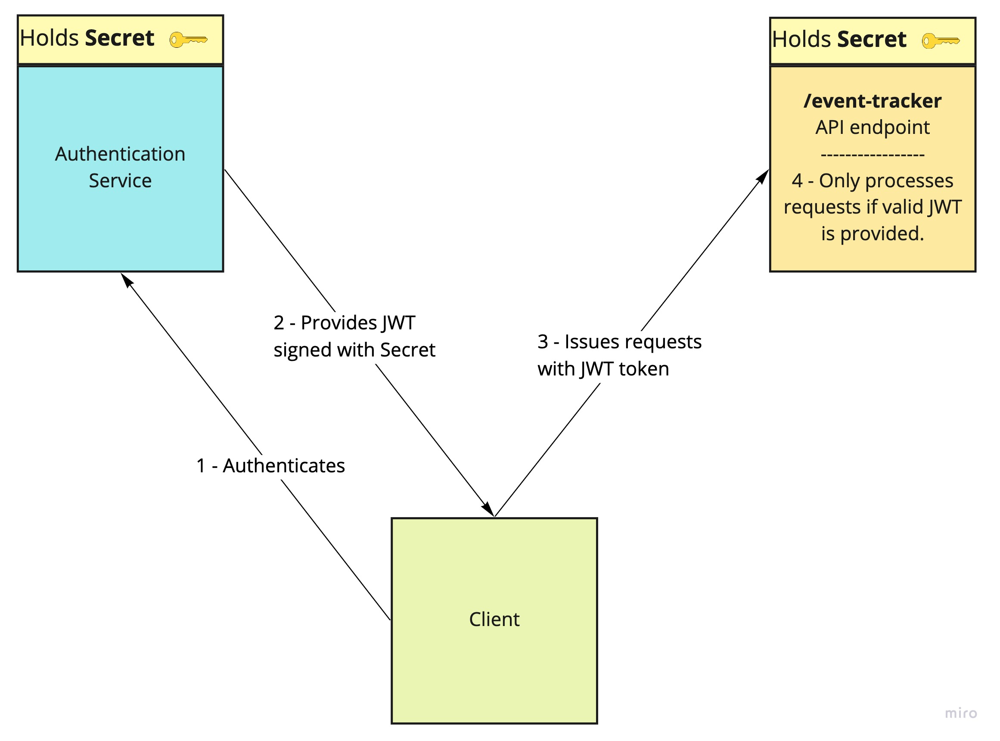

# event-tracker

This project contains source code and supporting files for a serverless application that you can deploy with the SAM CLI. It includes the following files and folders.

- `/event-tracker` - Code for the application's Lambda function.
- `/events` - Template Invocation events that you can use to invoke the function.
- `/event-tracker/tests` - Unit tests for the application code. 
- `template.yaml` - A template that defines the application's AWS resources.


## Prerequesites

* AWS account with an IAM role.

* SAM CLI - [Install the SAM CLI](https://docs.aws.amazon.com/serverless-application-model/latest/developerguide/serverless-sam-cli-install.html)
* Node.js - [Install Node.js 10](https://nodejs.org/en/), including the NPM package management tool.
* Docker - [Install Docker community edition](https://hub.docker.com/search/?type=edition&offering=community)


## Endpoints & valid requests.

This application exposes a single API endpoint that accepts `POST` requests.  If ran locally, the resource will be accessible on `http://127.0.0.1:3000/track-event`. When deployed, the full address will be outputed by the CLI when deployment is finished.

### A Valid request

```
Endpoint: /event-tracker
Method: POST
payload: {
	eventType: [string], # 'buttonclick' | 'navigationclick'
	eventSource: [string], # Must be correctly paired with eventType
	userId: [uuid(v3)] # A valid uuid(v4)
}
----------
Response:
StatusCode: 204
body: empty
```

**List of valid `eventSource`**: `['#btn-1', '#btn-2', '#btn-3', '#navigation-1', '#navigation-2', '#navigation-3']`


## Endpoint protection considerations

The following solutions can be implemented and combined to protect our endpoint.

* Only allow requests from a list of **whitelisted origins**.
* Limiting the **payload size** of incoming requests.
* Implement IP **rate limiting**.
* JWT authentication, see diagram below.




## Local development setup & test

### Setup and Start the app

##### Clone the repository and `cd`.

```bash
git clone git@github.com:camfeghali/lambda-event-tracker.git && cd lambda-event-tracker
```

##### Install node dependencies.

```bash
cd event-tracker && npm install
```

##### Compile the Typescript code into Javascript.

This will create a `./dist` directory containing the compiled javascript code.

```bash
npm run build
```

##### Build the app (make sure you are in the root dir of the project).

```bash
cd .. && sam build
```

##### Run the app locally 

```bash
sam local start-api
```

The SAM CLI reads the application template to determine the API's routes and the functions that they invoke. The `Events` property on each function's definition includes the route and method for each path.

```yaml
Events:
  EventTrackerFunction:
    Type: Api
    Properties:
      Path: /track-event
      Method: post
```

You can now make `POST` requests to `http://127.0.0.1:3000/track-event`

### Testing

Make sure to be in the `/event-tracker` dir.

The tests run against the `/dist/app.js` file, so make sure to recompile using `npm run build` to run the tests against the latest version of your app.

```bash
npm run test
```


## Deploy the application

To deploy the app, make sure you are in the root dir of the project.

```bash
sam build
sam deploy --guided --profile <your_aws_profile> --region <aws_region>
```

You can ommit the `--profile` flag and use your default aws profile.

The first command will build the source of your application. The second command will package and deploy your application to AWS, with a series of prompts:

* **Stack Name**: The name of the stack to deploy to CloudFormation. This should be unique to your account and region, and a good starting point would be something matching your project name.
* **AWS Region**: The AWS region you want to deploy your app to; defaults to the `--region` flag if you provided one.
* **Confirm changes before deploy**: If set to yes, any change sets will be shown to you before execution for manual review. If set to no, the AWS SAM CLI will automatically deploy application changes.
* **Allow SAM CLI IAM role creation**: Many AWS SAM templates, including this example, create AWS IAM roles required for the AWS Lambda function(s) included to access AWS services. By default, these are scoped down to minimum required permissions. To deploy an AWS CloudFormation stack which creates or modifies IAM roles, the `CAPABILITY_IAM` value for `capabilities` must be provided. If permission isn't provided through this prompt, to deploy this example you must explicitly pass `--capabilities CAPABILITY_IAM` to the `sam deploy` command.
* **Save arguments to samconfig.toml**: If set to yes, your choices will be saved to a configuration file inside the project, so that in the future you can just re-run `sam deploy` without parameters to deploy changes to your application.


**You can find your API Gateway Endpoint URL in the output values displayed after deployment.**

